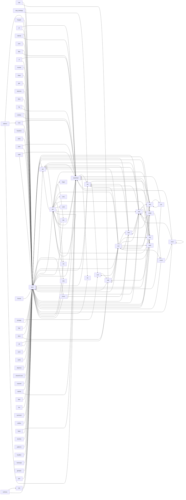

```mermaid
graph LR
	oae --> enm
	efo --> enm
	npo --> enm
	clo --> efo
	envo --> enm
	ncit --> enm
	obi --> enm
	bao --> enm
	obo --> enm
	ncit --> bao
	ccont --> enm
	clo --> enm
	chebi --> enm
	ncit --> xsd
	obo --> go
	iao --> enm
	pato --> enm
	bao --> ncit
	aop_ontology --> enm
	efo --> bto
	enm --> obi
	core --> oboInOwl
	enm --> npo
	hsapdv --> enm
	bto --> enm
	enm --> chebi
	enm --> bao
	pr --> oboInOwl
	bto --> efo
	ubprop --> enm
	bfo --> enm
	omo --> enm
	fbbt --> enm
	go --> enm
	cl --> oboInOwl
	oboInOwl --> enm
	chebi --> oboInOwl
	chmo --> enm
	obi --> efo
	mondo --> enm
	npo --> iao
	cl --> enm
	chebi --> npo
	efo --> obo
	doap --> enm
	efo --> bcgo
	gaz --> enm
	efo --> ncit
	dcterms --> enm
	core --> enm
	obo --> oboInOwl
	obcs --> enm
	oba --> enm
	efo --> clo
	pato --> oboInOwl
	dc --> enm
	go --> oboInOwl
	xsd --> rdfs
	npo --> bfo
	uberon --> enm
	hp --> enm
	uberon --> core
	ncbitax --> enm
	bto --> oboInOwl
	oboInOwl --> obi
	npo --> obo
	cito --> enm
	npo --> bao
	uberon --> oboInOwl
	fbbt --> oboInOwl
	obo --> efo
	hasobon --> enm
	envo --> oboInOwl
	ncit --> rdfs
	stato --> enm
	ncit --> bfo
	ncit --> npo
	chmo --> npo
	schema --> cito
	caro --> oboInOwl
	npo --> pato
	enm --> bfo
	ccont --> envo
	pr --> enm
	obi --> npo
	enm --> chmo
	enm --> pato
	valid --> oboInOwl
	bao --> obi
	pato --> npo
	ncit --> obi
	format --> enm
	protege --> xsd
	foaf --> enm
	ncit --> iao
	caro --> enm
	schema --> enm
	bfo --> efo
	valid --> enm
	ncit --> pato
	envo --> envo
	skos --> enm
	ncbitax --> oboInOwl
	enm --> ncit
	aop_ontology --> iao
	rdf --> rdfs
	efo --> cmo
	chebi --> ccont
	ncit --> chebi
	go --> obo
	efo --> bfo
	ubprop --> oboInOwl
	vann --> enm
	chmo --> bao
	swrla --> enm
	rdfs --> enm
	npo --> chebi
	protege --> enm
	depreca --> enm
	cheminf-core --> enm
	npo --> obi
	hp --> oboInOwl
	bao --> iao
	cheminf --> enm
	bfo --> rdfs
	caloha --> enm
	enm --> iao
	efo --> omit
	bibo --> enm
	oboInOwl --> iao
	foo --> enm
	bao --> npo
	efo --> obi
	synonym --> enm
	cellline --> enm
	rdfs --> ncit
	ncit --> obo
	skos --> rdfs
	rdf --> enm
	bspo --> oboInOwl
	shortha --> enm
	caloha --> oboInOwl
	patterns --> enm
	iao --> obo
	envo --> npo
	efo --> oba
	hasdbxr --> enm
	efo --> npo
	efo --> efo
	oboInOwl --> dc
	ncit --> ccont
	namespa --> enm
	bspo --> enm
	chmo --> oboInOwl
	genepio --> enm
	pav --> enm
	iao --> xsd
	efo --> oboInOwl
	oae --> rdfs
```