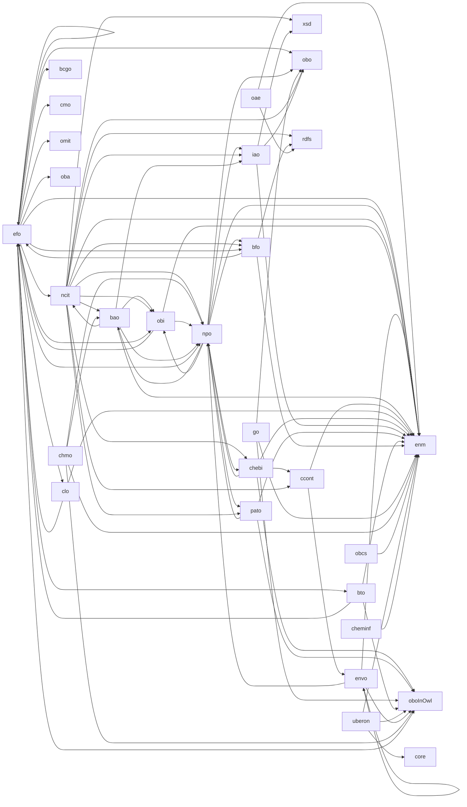

```mermaid
graph LR
	oae --> enm
	efo --> enm
	npo --> enm
	clo --> efo
	envo --> enm
	ncit --> enm
	obi --> enm
	bao --> enm
	ncit --> bao
	ccont --> enm
	clo --> enm
	chebi --> enm
	ncit --> xsd
	iao --> enm
	pato --> enm
	bao --> ncit
	efo --> bto
	bto --> enm
	bto --> efo
	bfo --> enm
	go --> enm
	chebi --> oboInOwl
	chmo --> enm
	obi --> efo
	npo --> iao
	chebi --> npo
	efo --> obo
	efo --> bcgo
	efo --> ncit
	obcs --> enm
	efo --> clo
	pato --> oboInOwl
	go --> oboInOwl
	npo --> bfo
	uberon --> enm
	uberon --> core
	bto --> oboInOwl
	npo --> obo
	npo --> bao
	uberon --> oboInOwl
	envo --> oboInOwl
	ncit --> rdfs
	ncit --> bfo
	ncit --> npo
	chmo --> npo
	npo --> pato
	ccont --> envo
	obi --> npo
	bao --> obi
	pato --> npo
	ncit --> obi
	ncit --> iao
	bfo --> efo
	ncit --> pato
	envo --> envo
	efo --> cmo
	chebi --> ccont
	ncit --> chebi
	go --> obo
	efo --> bfo
	chmo --> bao
	npo --> chebi
	npo --> obi
	bao --> iao
	cheminf --> enm
	bfo --> rdfs
	efo --> omit
	bao --> npo
	efo --> obi
	ncit --> obo
	iao --> obo
	envo --> npo
	efo --> oba
	efo --> npo
	efo --> efo
	ncit --> ccont
	chmo --> oboInOwl
	iao --> xsd
	efo --> oboInOwl
	oae --> rdfs
```